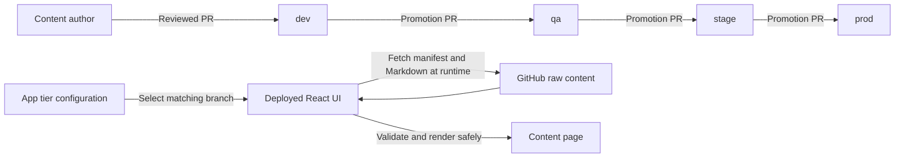
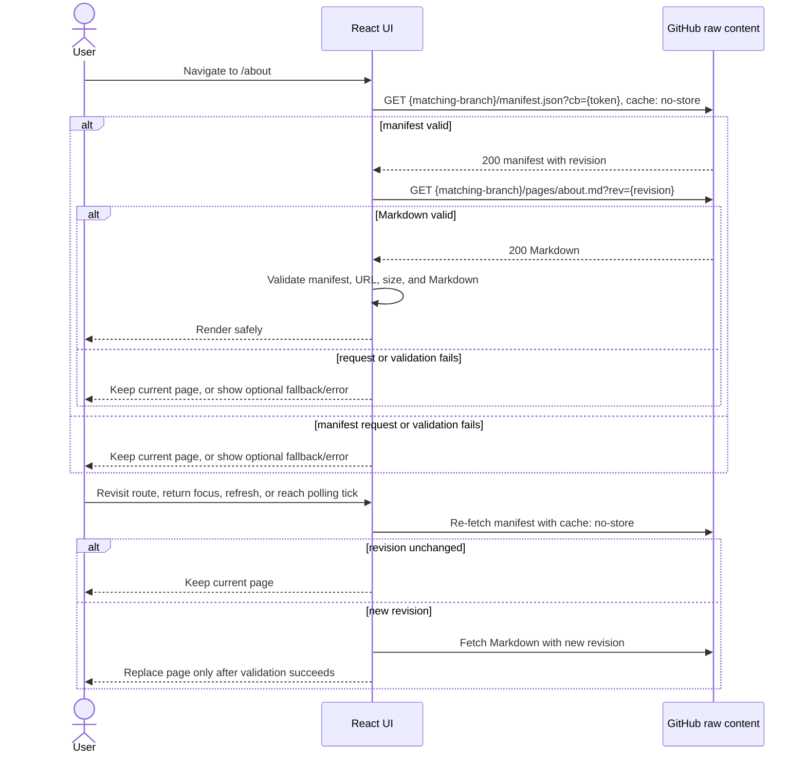

# Runtime Markdown Content Management for Static Information Pages

- **Status:** Proposed
- **Decision:** Direct browser fetch from a public GitHub raw-content endpoint
- **Scope:** `/about`, `/access_data`, `/analyze_data`, and `/support`
- **Last updated:** 2026-09-06

## 1. Executive summary

The CRDC Population Sciences UI currently compiles About, access, analysis, and support content into the frontend artifact from a production YAML file. Although the browser requests that file after startup, the imported URL identifies an asset emitted by the frontend build. A content change therefore still requires a frontend rebuild and deployment.

This design moves approved prose into standard Markdown files in a separate **public** GitHub content repository and uses a small JSON manifest for routes and constrained presentation metadata. The content repository has four protected promotion branches—`dev`, `qa`, `stage`, and `prod`—matching the application's four deployment tiers. The **deployed browser application** fetches the manifest and Markdown at runtime directly from its tier's matching branch on `raw.githubusercontent.com`. Markdown is never imported into the JavaScript bundle and is never copied into that bundle by the static build. Content advances only through reviewed pull requests in the sequence `dev → qa → stage → prod`, allowing it to be validated in each application tier before production. A merge to a tier's configured content branch becomes visible through runtime revalidation without rebuilding or redeploying `crdc-popsci-ui`.


### Goals

- Publish approved content-only changes without rebuilding or redeploying the UI.
- Require the already-deployed browser to retrieve current content from the separate repository at runtime; the frontend build cannot import, generate, or synchronize the remote Markdown.
- Replace YAML and the custom `$$` mini-language with standard Markdown plus a small JSON manifest.
- Keep the implementation simple: browser-to-public-GitHub reads, with no new server-side component.
- Preserve current route URLs, layout, images, links, tables, accessibility, and reliable user-facing fallbacks.
- Treat organizational GitHub content as untrusted runtime input and prevent it from becoming executable browser content.
- Retain review history, deterministic rollback, and clear ownership in GitHub.
- Promote and test the identical content change across `dev`, `qa`, `stage`, and `prod` through required inter-branch pull requests.

### Non-goals

- Building a general CMS, WYSIWYG editor, or preview server.
- Build-time Markdown imports, build hooks that copy the content repository, or pipelines that rebuild/redeploy `crdc-popsci-ui` after a content merge.
- Supporting a private content repository in the selected architecture.
- Moving application behavior, navigation authorization, React components, MDX, JSX, or executable code into the content repository.
- Allowing the manifest to create arbitrary application routes.
- Providing guaranteed real-time propagation to an already-open page.
- Solving server-side rendering or SEO for the application.
- Migrating unrelated landing-page configuration or README-dialog content.

## 2. Current-state analysis

### Content flow today

1. [`src/pages/about/aboutController.js`](../../src/pages/about/aboutController.js) statically imports `src/content/prod/aboutPagesContent.yaml`. Webpack turns that import into a URL for an asset inside the compiled frontend artifact.
2. The controller uses Axios to request the emitted asset, parses it with `js-yaml`, finds the object whose `page` equals React Router's `match.path`, and stores it in component state.
3. [`src/pages/about/aboutView.js`](../../src/pages/about/aboutView.js) passes title, images, content, table, and optional zoom-image metadata to `AboutHeader` and `AboutBody`.
4. [`src/components/About/aboutBodyView.js`](../../src/components/About/aboutBodyView.js) is a large, custom YAML-structure renderer. It implements paragraphs; ordered, unordered, and alphabetic lists; headings; emphasis; emails; downloads; tables; arbitrary inline table styles; links; external-link icons; primary images; and secondary zoomable images.
5. That renderer also parses a nonstandard `$$` mini-language, including `*bold*`, `#heading#`, `~first heading~`, `!italic!`, `>indent>`, custom link forms, and download forms.
6. [`src/bento/aboutPagesRoutes.js`](../../src/bento/aboutPagesRoutes.js) lists `/about`, `/access_data`, `/analyze_data`, and `/support`. [`src/components/Layout/LayoutView.js`](../../src/components/Layout/LayoutView.js) registers those paths with the common About controller.

The current browser request is therefore runtime loading of a **build-owned asset**, not independent runtime content management.

### Existing capabilities and inconsistencies

- [`src/components/ReadMeDialog/ReadMe.component.js`](../../src/components/ReadMeDialog/ReadMe.component.js) already renders Markdown with `react-markdown`.
- [`package-lock.json`](../../package-lock.json) resolves `react-markdown` `8.0.7`, but [`package.json`](../../package.json) does not declare it directly. It arrives transitively through `@bento-core/footer`; production code must not rely on that accidental dependency.
- `remark-gfm` is not a direct dependency. It is needed for GitHub-flavored tables and other approved GFM syntax.
- `dompurify` is already direct, but this design does not create raw HTML: `react-markdown` parses Markdown to a React element tree, raw HTML remains disabled, and `dangerouslySetInnerHTML` is forbidden.
- [`conf/inject.template.js`](../../conf/inject.template.js), [`conf/entrypoint.sh`](../../conf/entrypoint.sh), and [`src/utils/env.js`](../../src/utils/env.js) already support public runtime configuration. They are suitable for content URL configuration and flags, never credentials.
- [`Dockerfile`](../../Dockerfile) builds with Node and serves the compiled React 17 application from Nginx. [`conf/nginx.conf`](../../conf/nginx.conf) serves static assets and the SPA fallback. There is no secure application server in the UI container, which reinforces the no-secret, public-repository design.
- The environment-specific files under [`src/content`](../../src/content) are not dynamically selected. The controller explicitly imports only `prod/aboutPagesContent.yaml`. The `dev`, `local`, `perf`, `qa`, `qa2`, and `stg` copies contain legacy `/bento` and `/resources` content rather than the active Population Sciences pages.
- Production YAML includes `/submit`, but [`src/bento/aboutPagesRoutes.js`](../../src/bento/aboutPagesRoutes.js) does not register `/submit`. The new manifest must not silently activate it.
- Existing primary images use public `raw.githubusercontent.com` URLs, so the application already has an external asset and Content Security Policy (CSP) dependency that should be made explicit.

## 3. Requirements, assumptions, and open decisions

### Functional requirements

| ID | Requirement |
| --- | --- |
| F1 | A merged, approved content change can appear without a frontend build or deployment. |
| F2 | Each supported route maps to exactly one manifest entry and one Markdown document. |
| F3 | Standard Markdown supports headings, paragraphs, emphasis, links, mail links, ordered/unordered lists, images, and GFM tables. |
| F4 | A constrained manifest supports title, primary image/alt/position, and an optional secondary zoomable image. |
| F5 | The UI provides intentional loading, 404, error, stale, retry, and fallback behavior. |
| F6 | Content changes are reviewed, validated, auditable, and reversible by Git commit/ref. |
| F7 | Runtime content never executes HTML, script, JSX, or unsafe URLs. |

### Quality requirements

| Area | Requirement |
| --- | --- |
| Freshness | Under healthy conditions, the next navigation/focus/refresh fetches the current approved manifest according to the documented cache-busting policy. |
| Availability | A GitHub or network failure produces an explicit error or the optional bundled fallback; it never renders partial or mismatched content. |
| Security | No GitHub credential is present in JavaScript, runtime config, source maps, or browser requests. Remote content is untrusted and constrained. |
| Performance | Each revalidation uses one small manifest request; Markdown is fetched only when the manifest revision changes, and revisioned URLs can use normal browser/CDN caching. |
| Accessibility | Output uses semantic headings/lists/tables, descriptive alt text, visible focus, meaningful links, and accessible status announcements. |
| Compatibility | Existing URLs and the surrounding `Stats`/header layout remain stable. |
| Auditability | The selected content version/ref is visible in diagnostics, and Git history supplies author/reviewer/rollback history. |

### Assumptions

- The content repository is public and contains only material approved for public release. Pull-request branches and history are also assumed public.
- GitHub pull requests, protected branches, and CODEOWNERS are an acceptable authoring/approval workflow.
- All four long-lived content branches and their history are public. Content visible in `dev`, `qa`, or `stage` must therefore also be safe for public disclosure before production promotion.
- The pages are small, public, read-only, and change infrequently; anonymous direct GitHub delivery is operationally acceptable.
- No browser credential is necessary. If the repository later becomes private, this architecture must be replaced rather than patched with a frontend token.
- The deployment environment can permit precisely scoped requests to `raw.githubusercontent.com` in CSP.
- The application can show an optional static bundled fallback that changes only with normal UI releases.

### Open decisions

| Decision | Recommended default | Owner |
| --- | --- | --- |
| Content repository | Dedicated public CRDC repository containing no drafts/secrets that cannot be public | Product/content governance |
| Tier/branch mapping | `dev → dev`, `qa → qa`, `stage → stage`, `prod → prod`; fail closed for any other ref | Release management |
| Promotion path | Required PRs `topic → dev`, `dev → qa`, `qa → stage`, and `stage → prod`; no direct pushes or skipped tiers | Content/release owners |
| Revision convention | Required unique manifest `revision` changed with every content publication, used for cache identity and diagnostics | Content/UI owners |
| Open-page polling | Start at five minutes with jitter; allow `0` only when product explicitly accepts updates solely on navigation/focus/refresh | Product |
| Allowed external link hosts | Permit general `https` links only if product requires them; prefer a reviewed host allowlist | Security/content owner |
| Allowed image hosts | Only `raw.githubusercontent.com` for the configured content repository at launch | Security |
| New-tab behavior | Same tab by default; explicit external-new-tab policy only where justified | UX/accessibility |
| Bundled fallback | Enable during rollout, then decide whether to retain the static emergency snapshot | Product/SRE |
| `/submit` | Omit unless separately approved and added to the application route allowlist | Product |
| Nonproduction content | Each application tier reads the matching long-lived content branch; do not restore six drifting YAML copies | Release management |

## 4. Selected solution: direct browser fetch from GitHub raw content

The already-deployed browser requests a JSON manifest and Markdown from URLs under:

```text
https://raw.githubusercontent.com/{owner}/{repository}/{ref}/{path}
```

This is the smallest solution and meets the primary objective. The content request occurs only at browser runtime: the UI build neither imports nor synchronizes the Markdown. It requires a public repository, careful browser validation, CSP changes, honest handling of GitHub outages/rate behavior, and cache-aware publication conventions. No authentication is sent.

## 5. Target architecture

### Components



Trust boundaries:

- GitHub content is public but **untrusted input** to the browser.
- Runtime config is public and untrusted for security decisions; code enforces owner/repository/path allowlists.
- Pull-request validation is the primary publication gate. Browser validation is independent defense in depth.
- Only React application code defines executable behavior and supported routes.
- The normal content path begins in the deployed browser. No content-repository checkout, Markdown import, or content synchronization occurs in the `crdc-popsci-ui` static build. The optional fallback is an explicitly stale emergency snapshot, not the publication mechanism.

### Publication sequence

```mermaid
sequenceDiagram
    actor Editor
    participant GH as Public GitHub repository

    Editor->>GH: PR topic branch into dev
    GH->>GH: Required checks, review, and merge
    Editor->>GH: PR dev into qa; test in QA
    Editor->>GH: PR qa into stage; test in Stage
    Editor->>GH: PR stage into prod
    GH->>GH: Required checks, review, and merge
    Note over GH: Content is promoted without rebuilding or redeploying the UI
```

### Runtime and revalidation sequence



“Keep current page” means the content already held in the mounted React component's ordinary state. It is not a separate cache, storage layer, or pre-existing repository feature. On an initial load with no current page, the UI shows the optional bundled fallback or an error with retry.

## 6. Content repository and contract

### Proposed structure

```text
crdc-popsci-content/
├── manifest.json
├── pages/
│   ├── about.md
│   ├── access-data.md
│   ├── analyze-data.md
│   └── support.md
├── assets/
│   ├── about-researchers.png
│   ├── access-network.png
│   ├── analyze-cloud.png
│   └── support-cloud.jpg
├── schemas/
│   └── manifest.schema.json
├── scripts/
│   └── validate-content.mjs
├── CODEOWNERS
└── README.md
```

The repository has four protected long-lived branches: `dev`, `qa`, `stage`, and `prod`. The file layout is identical on every branch. A normal author creates a topic branch and PR into `dev`; the same reviewed commit set is promoted by PR from `dev` to `qa`, `qa` to `stage`, and `stage` to `prod`. Direct pushes and lower-to-higher shortcuts are prohibited. Required checks rerun at every boundary, and reviewers validate the content in the corresponding deployed application tier before opening or approving the next promotion PR.

Each branch's `manifest.json` is the runtime entry point and carries a unique `revision`. Every change to Markdown, assets, routes, or presentation metadata must also change `revision`; required CI enforces this. The browser appends that revision to page and asset requests so previously cached bytes are not reused for a new promotion. Files use UTF-8, LF endings, lowercase kebab-case paths, and bounded sizes. Assets should live in the repository rather than depend on arbitrary third-party URLs.

### Tier and promotion contract

| Application tier | Content branch | Promotion source | Required validation before next tier |
| --- | --- | --- | --- |
| Development | `dev` | Approved topic PR | Automated validation and developer/content preview |
| QA | `qa` | PR from `dev` | Functional, visual, accessibility, and adversarial QA |
| Stage | `stage` | PR from `qa` | Production-like integration, CSP, caching, and rollback validation |
| Production | `prod` | PR from `stage` | Final content/release approval and passing required checks |

Promotion PRs must not contain unrelated edits made directly in the target branch. Branch-protection rules should require the source branch shown above, or an automated check should verify ancestry/content equivalence. If branches diverge, reconcile downward first and repeat promotion rather than manually re-creating a change in a higher branch.

### Manifest example

```json
{
  "schemaVersion": 1,
  "revision": "2026-09-06.1",
  "publishedAt": "2026-09-06T14:30:00Z",
  "pages": [
    {
      "route": "/about",
      "slug": "about",
      "title": "About the Population Science Data Commons (PSDC)",
      "markdown": "pages/about.md",
      "primaryImage": {
        "src": "assets/about-researchers.png",
        "alt": "Two researchers reviewing data on a computer in a laboratory",
        "position": "left"
      }
    },
    {
      "route": "/support",
      "slug": "support",
      "title": "Support",
      "markdown": "pages/support.md",
      "primaryImage": {
        "src": "assets/support-cloud.jpg",
        "alt": "Abstract representation of a hand interacting with a cloud control",
        "position": "left"
      },
      "secondaryImage": {
        "src": "assets/support-process.png",
        "alt": "Support request process",
        "caption": "Support request process",
        "zoomable": true
      }
    }
  ]
}
```

### Manifest invariants

- `schemaVersion` must be a supported integer; unknown versions fail closed.
- `revision` matches `^[0-9]{4}-[0-9]{2}-[0-9]{2}\.[1-9][0-9]*$` (or another documented, equally strict convention), changes whenever any runtime-served file changes, and is preserved unchanged while that exact change set is promoted across branches.
- `route` and `slug` are unique and must exist in the application-owned allowlist.
- `title` and captions are plain text with length limits; Markdown/HTML is forbidden.
- Every `markdown` path is normalized and relative under `pages/`. New assets should use normalized paths under `assets/`; the initial migration may retain existing `https://raw.githubusercontent.com/CBIIT/datacommons-assets/...` image URLs through an explicit allowlist until those binaries are copied into the content repository.
- Reject absolute paths, backslashes, empty segments, `.`/`..`, percent-encoded traversal, NUL/control characters, query strings, fragments, protocol-relative values, and case collisions.
- `position` and `zoomable` are bounded schema values, never CSS or code.
- Referenced files must exist, be allowed types, and satisfy per-file/total size limits in required CI.
- The UI also validates these invariants before constructing any URL; a compromised manifest cannot turn the browser into an arbitrary fetch client.
- Content cannot add `/submit` or any other route unless the application is separately changed to allow it.

### Markdown example

`pages/access-data.md`:

```markdown
The PSDC portal provides faceted searching for studies of interest using study,
design, enrollment, cancer type, country, biospecimen, and demographic criteria.

## Controlled-access data

Open-access data requires no authorization. To use controlled-access data,
researchers must first obtain authorization through
[dbGaP](https://dbgap.ncbi.nlm.nih.gov/home).

| Access type | Authorization | Delivery |
| --- | --- | --- |
| Open | Not required | Seven Bridges Cancer Genomics Cloud |
| Controlled | NCI Data Access Committee approval | Authorized cloud workspace |

Questions can be sent to [NCICRDC@mail.nih.gov](mailto:NCICRDC@mail.nih.gov).
```

The manifest title supplies the sole page-level `h1`; body Markdown starts at `h2`. Raw HTML, MDX, JSX, imports, scripts, iframes, forms, styles, custom directives, and inline Mermaid are forbidden.

## 7. Remote URL, caching, and consistency design

### Runtime-injected configuration

Add public values to [`conf/inject.template.js`](../../conf/inject.template.js) and expose them through [`src/utils/env.js`](../../src/utils/env.js):

| Variable | Example | Purpose |
| --- | --- | --- |
| `REACT_APP_CONTENT_GITHUB_RAW_BASE` | `https://raw.githubusercontent.com` | Approved raw-content origin; must exactly match a compiled allowlist. |
| `REACT_APP_CONTENT_GITHUB_OWNER` | `CBIIT` | Expected repository owner; checked against a compiled allowlist. |
| `REACT_APP_CONTENT_GITHUB_REPO` | `crdc-popsci-content` | Expected public repository; checked against a compiled allowlist. |
| `REACT_APP_CONTENT_GITHUB_REF` | `prod` | Exact protected content branch matching this application tier. Allowed values are only `dev`, `qa`, `stage`, and `prod`. |
| `REACT_APP_CONTENT_MANIFEST_PATH` | `manifest.json` | Fixed, normalized manifest path. |
| `REACT_APP_REMOTE_CONTENT_ENABLED` | `false` | Deployment-controlled rollout/rollback flag. |
| `REACT_APP_CONTENT_POLL_MS` | `300000` | Open-page polling interval; five minutes is the recommended starting default. Set `0` only if product explicitly accepts no automatic open-page updates. |
| `REACT_APP_CONTENT_FALLBACK_ENABLED` | `true` | Enables the optional bundled migration fallback. |

All values are visible to users. They contain no GitHub token, secret, private URL, or authorization header. The application must not accept a free-form base URL from query parameters, the manifest, `localStorage`, or remote content. A code-owned builder creates URLs only after owner/repository/ref/path validation.

Deployment configuration enforces this mapping: the development application uses `dev`, QA uses `qa`, stage uses `stage`, and production uses `prod`. Startup should fail closed or disable remote content when the configured ref does not match the tier. Runtime content must never select a higher or lower branch from a query parameter or manifest value.

### URL strategy

The manifest URL is:

```text
https://raw.githubusercontent.com/{allowed-owner}/{allowed-repo}/{allowed-ref}/{allowed-manifest-path}?cb={time-bucket}
```

The selected mechanism fetches the small manifest with `cache: "no-store"` and a changing cache-buster on every content-route navigation, window focus/visibility return, browser refresh, and enabled polling tick. A timestamp or monotonic revalidation token is appropriate because revalidation events are bounded; request deduplication prevents simultaneous focus/navigation calls. Using both mechanisms makes the intent explicit to the browser and prevents indefinite reuse of one mutable URL through an intermediary. Do not assume raw GitHub cache behavior is an API guarantee; verify it in supported browsers and monitor it. GitHub/CDN propagation means zero-latency consistency cannot be guaranteed.

After manifest validation, Markdown and assets use stable branch paths plus `?rev={revision}`. Every promoted content change has a new revision, so the request URL changes even though `pages/about.md` does not. The current page remains in ordinary React component state while it is displayed; there is no separate application content cache. The live Markdown is obtained only by this runtime fetch; it is not an ES import, Webpack asset, generated source file, or build input.

The manifest and content files are separate requests to one branch. Required CI guarantees that a revision and all referenced files are changed/promoted together, and the revision query prevents reuse of bytes from the prior promotion. GitHub edge propagation can still briefly expose a new manifest before the matching file bytes are available. The client therefore fetches and validates the complete page before replacement, retries a revision mismatch/transient 404 with bounded backoff, and otherwise retains the current page or bundled fallback.

### Why not depend on `ETag` alone

Raw responses may include validators, and the browser may issue conditional requests, but cross-origin header exposure and intermediary cache behavior must be tested rather than assumed. The client does not need to read `ETag` to be correct. The no-store/cache-busted branch manifest plus revision-busted content paths provide explicit application semantics. If testing confirms accessible, stable validators, conditional requests may supplement this design.

## 8. Frontend design

### Modules and responsibilities

| Proposed module | Responsibility |
| --- | --- |
| `src/services/content/contentUrl.js` | Validate configured owner/repository/ref, normalize fixed relative paths, and construct only approved raw URLs. |
| `src/services/content/contentClient.js` | Fetch with timeouts, aborts, redirect/final-origin checks, byte limits, content-type checks, and response classification. |
| `src/services/content/contentSchema.js` | Validate the manifest and enforce route/slug/path/version invariants. |
| `src/pages/content/contentController.js` | Map `match.path` to an allowed slug; own load/revalidate/stale/error/404 state; prevent response races. |
| `src/pages/content/contentView.js` | Compose `Stats`, `AboutHeader`, images, status UI, and the Markdown renderer. |
| `src/components/Content/MarkdownContent.js` | Configure the AST renderer, GFM, element allowlist, safe links/images, semantic tables, and styles. |
| `src/bento/contentPageRoutes.js` | Keep the application-owned route-to-slug allowlist; initially preserve the four current routes. |

### Dependencies and safe rendering

- Declare and lock a React-17-compatible, security-reviewed `react-markdown` version directly in [`package.json`](../../package.json). Version 8.0.7 is present today only transitively and is not an intentional guarantee.
- Declare and lock a compatible `remark-gfm` directly for tables, strikethrough, task lists, and autolinks.
- `react-markdown` v8 normally parses Markdown into a syntax tree and creates React elements; it does not use `dangerouslySetInnerHTML` for ordinary Markdown and escapes/ignores raw HTML unless raw-HTML processing is added. Preserve that safe default.
- Never use `dangerouslySetInnerHTML` for fetched content. Do not install or enable `rehype-raw`. Do not use MDX, evaluate code blocks, execute JSX, or dynamically import anything named by content.
- Set an explicit allowed-element list, for example: `p`, `br`, `strong`, `em`, `del`, `h2`–`h6`, `ul`, `ol`, `li`, `a`, `blockquote`, `code`, `pre`, `hr`, `table`, `thead`, `tbody`, `tr`, `th`, `td`, and `img`. Exclude `h1` because the manifest title owns it. Decide whether code/pre are actually needed; omit them if not.
- Configure disallowed elements to unwrap or reject according to tests; security-sensitive nodes/attributes fail closed. Content cannot provide React props, styles, classes, IDs, event handlers, or arbitrary data attributes.
- `react-markdown`'s default URI handling is helpful but not the complete policy. Custom link/image renderers must validate canonical URLs, final allowed origins, link attributes, and repository-relative asset resolution.
- `DOMPurify` is not required when raw HTML never enters the tree. If raw HTML is proposed later, it requires a new security decision and a strict sanitization design; adding `DOMPurify` around a dangerous pipeline is not automatic approval.

### CCDI ODS page-style reference

Use the visual treatment in [`ccdi-ods-ui/src/app/post/[...slug]/serverUtils.ts`](https://github.com/CBIIT/ccdi-ods-ui/blob/main/src/app/post/%5B...slug%5D/serverUtils.ts) as the starting reference for Markdown page styling. Recreate the relevant results with `react-markdown` component overrides and this repository's Material UI `withStyles`/theme conventions; do not copy its Next.js, Tailwind, server-side Unified pipeline, or generated HTML directly.

| Markdown element | Referenced treatment to adapt |
| --- | --- |
| Page body | Nunito, `18px`, black text, approximately `28px` line height, with consistent paragraph spacing |
| `h2` | Inter semibold; `24px` on mobile and `32px` on desktop; teal background with white text on mobile, blue text on a transparent background on desktop |
| `h3` | Inter regular; approximately `22px` mobile and `28px` desktop; blue text with clear section spacing |
| `h4`–`h6` | Progressively smaller Inter headings; preserve hierarchy, with `h6` bold/uppercase only when content semantics justify it |
| Links | Nunito, teal `#1C8278`, medium weight, visibly underlined; external links receive the application-owned external-link indicator |
| Lists | Native disc/decimal markers, responsive left indentation, and the same typography/line height as body text |
| Images | Responsive `max-width: 100%`, automatic height, centered, lazy-loaded, with restrained vertical spacing; shadow only where it matches the page design |
| Tables | Inter cell text, blue top/header rules, light row separators, left-aligned headers, wrapping cell content, and a container with horizontal overflow on narrow screens |
| Blockquotes | A restrained left border, padding, and italic treatment while retaining sufficient contrast |

Implementation rules:

- Put these values in one application-owned `markdownStyles` definition using existing theme tokens where equivalent tokens exist. Do not place Tailwind class names or inline styles in Markdown.
- Keep the manifest title in the existing `AboutHeader`; body Markdown starts at `h2`. Do not reproduce the reference's styled Markdown `h1` because this application already owns the page header.
- Wrap rendered tables in a responsive container (`overflow-x: auto`) rather than applying scrolling to the table itself. Preserve semantic `table`, `thead`, `th`, and `td` elements and keyboard-visible focus where the container can scroll.
- Render the external-link icon from this application's controlled assets and mark a purely decorative icon `aria-hidden="true"`; the link's accessible name remains its text.
- Do not adopt the reference's mobile `h2` accordion automatically. Collapsing sections is interactive behavior, not styling, and would require a separate UX/accessibility requirement and keyboard/state implementation.
- Do not adopt syntax highlighting unless these information pages gain a real code-sample requirement.
- The reference processor enables dangerous HTML and supports selected iframes. Those behaviors are explicitly **not** adopted: raw HTML remains disabled, `rehype-raw` remains absent, iframes are outside the element allowlist, and remote content never reaches `dangerouslySetInnerHTML`.

### Link renderer

- Accept `https:` for remote links and `mailto:` only where email links are needed. Same-application relative links may be allowed and routed internally.
- Reject `javascript:`, `data:`, `blob:`, `file:`, `http:`, protocol-relative (`//`), user-info-bearing, malformed, and unknown schemes.
- Strip ASCII controls and whitespace, repeatedly decode/normalize as appropriate, parse with the platform `URL` implementation, and compare the canonical scheme/origin. Tests must cover mixed case, tabs/newlines, HTML entities, and percent-encoded scheme bypasses.
- Prefer an explicit hostname allowlist for public links. If product requires arbitrary `https` destinations, keep image hosts strict and clearly mark external links.
- Open links in the same tab by default. If policy requires `target="_blank"`, add `rel="noopener noreferrer"` and accessible text/icon indicating a new tab. Never accept `target` or `rel` from Markdown.
- `mailto:` supports only an address form needed by current content. Reject headers such as `bcc`, overly long values, controls, and unexpected parameters unless explicitly required.

### Image renderer

- Permit only `https:` image URLs on `raw.githubusercontent.com` whose canonical path is in the configured public content repository or the explicitly allowlisted legacy `CBIIT/datacommons-assets` repository. Prefer content-repository relative assets for new content.
- Resolve relative paths against a code-constructed approved version-directory base, never against `document.location` or a manifest-supplied absolute base.
- Re-run traversal/path checks before URL construction and verify the parsed result retains the expected `raw.githubusercontent.com` origin, owner, repository, ref, and version prefix.
- Reject `data:`, `blob:`, SVG data, protocol-relative URLs, redirect results outside the approved origin, and arbitrary tracking hosts.
- Prefer raster images. If SVG is required, security-review and sanitize it in repository CI; do not inline it into the DOM. Serve as an image resource only and test script/event behavior.
- Require nonempty alt text for informative images. Limit decoded dimensions and response bytes, set responsive dimensions/aspect ratio, and use lazy loading where appropriate.

### Network client controls

- Use `fetch` or Axios with `AbortController`, a short configurable timeout, and cancellation on route change/unmount.
- Request only `GET`, omit credentials (`credentials: "omit"`), send no authorization/cookies, and do not log complete remote bodies.
- Check `response.ok`, status, and final `response.url`. Reject redirects/final responses whose canonical origin and path no longer match policy. Browser fetch follows redirects by default; final-origin validation is therefore mandatory, and `redirect: "error"` may be used if supported consistently.
- Validate manifest `Content-Type` as JSON-compatible and Markdown as `text/plain`, `text/markdown`, or another explicitly observed raw-GitHub text type. Do not rely on content type alone.
- Enforce maximum response size. Prefer checking `Content-Length` when present and stream/count bytes to enforce the limit when absent or deceptive. Abort before decoding beyond the limit.
- Bound manifest pages, nesting/depth, strings, Markdown bytes, AST node count, table cells, image count, and link count to resist CPU/memory denial of service.
- Parse JSON in a guarded path and validate against a code-owned schema. Never merge it into application objects in a way that permits prototype pollution.

### UI states, accessibility, and race handling

Use explicit `loading`, `ready`, `refreshing`, `stale`, `notFound`, and `error` states:

- **Initial loading:** keep the page shell stable and use a skeleton/progress label with `aria-live="polite"`.
- **Refreshing:** retain current content while checking the manifest. Do not flash a full loading page.
- **404:** show the application content-not-found view for a valid application route whose manifest entry/file is absent. Never substitute another route.
- **Failure:** if enabled, render the same route's bundled fallback with a nonblocking “may be out of date” notice and retry action. Otherwise show an accessible error and support path.
- **Invalid response:** never partially render it. Preserve current valid content or fall back.

Associate requests with normalized route, branch, revision, and a monotonically increasing request ID. Only the latest request may update state. Abort superseded requests so a slow `/about` response cannot overwrite `/support`. Fetch and validate the complete new page before atomically changing the rendered document. Do not move focus when background content refreshes; announce a change politely only if helpful.

### Replacing the custom AboutBody renderer

Initially keep the current image grid and header around the new `MarkdownContent` renderer for visual parity. Replace the YAML content-array branch in [`src/components/About/aboutBodyView.js`](../../src/components/About/aboutBodyView.js), while retaining separately modeled primary/secondary image behavior. After rollout and the rollback window, remove YAML loading, `js-yaml` if unused elsewhere, the `$$` parser, inline-style parser, and obsolete styles/assets. The README dialog can later share the hardened renderer, but that is a separate change.

## 9. Freshness semantics

There is no push path from GitHub to open browsers. Freshness consists of GitHub merge/edge propagation, the mutable-manifest cache interval, and the browser's next revalidation event.

### Initial behavior

- Fetch the current cache-busted manifest with `cache: "no-store"` on every content-route navigation, including navigation back to the same route.
- When the document regains focus or visibility, revalidate in the background and deduplicate near-simultaneous lifecycle requests.
- A browser refresh performs a new runtime manifest request; it cannot depend on content embedded by the UI build.
- Enable configurable polling at a five-minute starting interval so a continuously open page can discover approved updates. Set polling to `0` only when product explicitly prefers a stable reading surface over automatic refresh.
- When a newer valid `revision` is found on the tier's configured branch, fetch and validate the entire document/assets metadata, then atomically replace the page.
- Never promise an exact merge-to-browser time without measurements. Document the configured interval as an expected healthy bound, plus GitHub propagation and the user's next lifecycle event.

### Configurable open-page polling

At each enabled polling interval, issue the same cache-busted, `no-store` manifest request. Add jitter, pause hidden tabs, abort on unmount, back off on failure/`429`, and keep existing content. Five minutes is a simple starting default, not an instantaneous-consistency promise. Product may disable polling if automatic replacement would disrupt long-form reading; navigation/focus/refresh revalidation remains mandatory.

SSE and WebSockets are not available without adding a service and are outside the selected architecture.

## 10. Threat model and security controls

Organizational ownership and PR review reduce likelihood but do not make remote bytes trusted. Account compromise, malicious dependencies/workflows, review mistakes, and cached old content remain credible.

| Threat | Example impact | Required controls |
| --- | --- | --- |
| Stored XSS / HTML injection | Markdown contains `<script>`, event attributes, iframe, or malicious HTML | `react-markdown` AST rendering; raw HTML disabled; no `rehype-raw`; no `dangerouslySetInnerHTML`; explicit element allowlist; adversarial tests; CSP defense in depth |
| JavaScript/unsafe links | `[click](javascript:...)`, encoded/mixed-case scheme, `data:` payload | Canonical custom URL validator; allow only approved `https`, constrained `mailto`, and approved relative routes; reject controls/encoding bypasses |
| MDX/JSX execution | Content imports or renders a component with side effects | Plain Markdown only; no MDX parser/runtime, dynamic imports, eval, JSX, or executable code-block plugins |
| Malicious images/tracking | External pixel tracks users; huge image exhausts memory; active SVG attacks | Versioned repository-relative assets; exact host/path allowlist; type/byte/dimension limits; prefer raster; CSP `img-src`; no credentials/referrer where feasible |
| Tabnabbing | External `_blank` page controls opener | Same-tab default or forced `rel="noopener noreferrer"`; content cannot supply target/rel |
| Path traversal / arbitrary fetch | Manifest path uses `../`, encoded slash, absolute or protocol-relative URL | Strict schema/regex; decode and normalize; reject traversal/query/fragment/controls; code-owned URL builder; verify final URL prefix/origin |
| Manifest tampering | Adds arbitrary route, host, CSS, or unsupported renderer behavior | Application route allowlist; unknown-field rejection; bounded enums; plain-text title; version/path invariant; required CI and browser revalidation |
| Compromised maintainer/workflow | Attacker merges malicious or misleading content | Protected branch, required independent PR review, CODEOWNERS, least-privilege collaborators, MFA/organization policy, restricted actions, audit log, rollback by ref/commit |
| Dependency compromise | Markdown plugin introduces unsafe behavior | Direct locked dependencies, reviewed upgrades, Dependabot/dependency scanning, lockfile integrity, pinned CI actions, SBOM/security advisories, regression tests |
| Markdown denial of service | Huge/deep lists/tables or pathological syntax freezes tab | Network byte cap, timeout/abort, AST node/depth/table/link/image caps, fixtures, graceful fallback, worker evaluation only if measurement warrants |
| GitHub outage/rate limiting | New navigation cannot fetch manifest/content | Keep the currently rendered React state when available; use bounded retries/backoff and the optional bundled fallback or explicit error |
| Stale/poisoned browser/CDN data | Browser displays an old or mismatched revision | `no-store` cache-busted branch manifest; revision query on every referenced file; schema/path checks; complete-page validation before swap; UI diagnostics; rollback PR with a new revision |
| Redirect/final-origin escape | Approved raw URL redirects to an attacker host | Omit credentials; `redirect: "error"` where feasible; always validate final `response.url` origin/path before reading/rendering |
| Content-type confusion | HTML/error page is treated as Markdown/image | Check status, allowed content type, byte signature where relevant, body/schema, and final URL; never inject raw body as HTML |

### What `react-markdown` v8 does and does not provide

| Protection | Default/library behavior | Application responsibility |
| --- | --- | --- |
| Ordinary Markdown rendering | Parses to syntax tree and React elements rather than requiring HTML injection | Keep this path; prohibit `dangerouslySetInnerHTML` wrappers |
| Raw HTML | Raw HTML is not rendered as active HTML unless raw processing such as `rehype-raw` is added | Do not install/enable `rehype-raw`; set explicit policy/tests |
| URI handling | Provides default URL transformation/safety behavior | Replace/supplement with canonical allowlist tailored to link vs image; test bypasses |
| Element set | Supports standard Markdown elements | Configure an explicit allowlist and custom renderers; exclude `h1`, raw/custom nodes, attributes/styles |
| GFM | Not enabled merely by core Markdown rendering | Add reviewed `remark-gfm`; ensure it does not add unsafe HTML behavior |
| Remote fetching | None | URL construction, timeout, size/type/final-origin checks, cancellation, caching, failures |
| Manifest trust | None | Strict schema, route allowlist, path/version validation, unknown-field rejection |
| MDX/JS execution | Not part of normal `react-markdown` | Never add MDX/evaluation plugins to this content path |

### CSP and browser headers

Inventory current production sources before changing CSP. The target policy should:

- add only `https://raw.githubusercontent.com` to `connect-src` for content requests;
- keep `script-src` restricted to existing application sources with no `'unsafe-eval'` added for content;
- restrict `img-src` to `'self'` and the exact approved raw image host (plus already-required, reviewed application sources);
- leave `object-src 'none'` and use restrictive `base-uri`, `frame-ancestors`, and `form-action` directives where compatible;
- avoid wildcard GitHub domains, `data:`, and `blob:` unless separately justified;
- deploy in report-only mode, test all existing features, then enforce.

CSP is defense in depth, not a substitute for URL validation. Raw GitHub shares a hostname across many repositories, so the application must also enforce owner/repository/path.

### Repository and supply-chain governance

- The repository is public and contains no credentials, internal-only drafts, private issue attachments, or sensitive metadata.
- Protect `dev`, `qa`, `stage`, and `prod`: pull requests only, required CI, required CODEOWNERS review, restricted force pushes/deletion, and independent approval for manifest/schema/workflow changes. Enforce the ordered promotion sources at each boundary.
- Require least-privilege repository roles and organizational MFA/security policy. Review collaborators and deploy keys; no runtime deploy key is needed.
- Pin GitHub Actions to reviewed commit SHAs where policy requires it; restrict workflow permissions, disallow untrusted write tokens, and protect workflow-file changes with CODEOWNERS.
- Enable secret scanning, dependency/Dependabot alerts, code/workflow scanning as applicable, and audit-log retention.
- Preserve commit ancestry and promotion-PR history. Roll back by reverting the bad change on the affected branch with a reviewed PR and assigning a new manifest revision; promote that revert forward through any higher affected branches. A temporary runtime ref to an approved commit SHA is an emergency-only action.

## 11. Reliability, observability, performance, SEO, rollback, and recovery

### Failure behavior

| Failure | User behavior | Operator/editor action |
| --- | --- | --- |
| Manifest request timeout/GitHub outage | Keep current validated page; on initial load show optional bundled fallback or error/retry | Check GitHub/status/network/CSP; avoid repeated publish attempts |
| Manifest invalid | Reject completely; keep current/fallback | Revert or correct commit; required CI should normally prevent this |
| Versioned Markdown transient 404 after merge | Bounded retry with jitter, then current/fallback | Confirm edge propagation and referenced path/case |
| Markdown invalid/oversized | Reject; never partially render | Publish a corrected change with a new revision through the branch sequence |
| Image unavailable | Preserve text/layout and alt text; report telemetry | Correct the asset with a new revision and promote it normally |
| New content is factually wrong | Continue technically valid content until reviewed rollback | Revert the bad commit on the affected branch, assign a new revision, validate, and promote the revert forward as needed |
| Runtime ref/config wrong | Fail closed to fallback/error | Correct deployment configuration; no secrets involved |

### Optional bundled last-known-good fallback

During rollout, bundle a reviewed Markdown snapshot per supported route with the UI. It is static, client-side, and updated only by a normal frontend release. It is not a synchronized cache and should never be described as current. When used, display a subtle stale-content notice and expose the fallback revision in diagnostics.

After a stable period, owners may retain it as emergency public information or reduce it to a minimal support page. Maintaining full fallback parity indefinitely creates a second content source and should be an explicit governance choice.

### Observability

Frontend telemetry should record, without remote bodies or personal data:

- manifest and Markdown success/failure/timeout by route and status class;
- validation rejection reason category;
- branch and revision rendered and whether remote, currently retained on screen, or bundled fallback;
- fetch and parse/render duration, response byte bucket, retry, and cancellation counts;
- focus/navigation revalidation and version-change counts;
- CSP violations for the content path.

Keep route and error dimensions low-cardinality; do not log arbitrary URLs from content. Add a support-only diagnostic showing UI version, configured repository/ref, manifest age, and rendered revision. Alert only if the telemetry platform can reliably distinguish widespread failures from individual offline clients.

### Performance

- Keep the manifest small and set strict page-count/string limits.
- Keep only the currently displayed validated page in React state; rely on revisioned request URLs and normal browser HTTP caching rather than a custom content cache.
- Cache-bust only when revalidation is due, not on every render.
- Use the manifest revision in Markdown/asset query strings so GitHub/browser caches can distinguish each promoted change.
- Compress/optimize images before commit and enforce byte/dimension budgets in CI.
- Avoid prefetching all pages. Optionally prefetch only a likely next route after the current page is interactive and respect data-saving preferences.
- Measure Markdown parse/render cost and enforce AST limits before considering a Web Worker.

### SEO limitation

The application is client-rendered. Crawlers and link-unfurl services that do not execute JavaScript may see only the shell; JavaScript-capable crawlers wait on an extra cross-origin request. This design does not improve SEO and can make discovery timing less deterministic than bundled content. If indexing becomes a requirement, evaluate separately deployed static snapshots, prerendering, or server-side rendering in a new design decision.

### Rollback and disaster recovery

- Normal rollback is a reviewed Git revert on the affected tier branch with a newly incremented manifest revision. If a bad revision reached multiple tiers, promote the revert through the same ordered PR chain. No UI deployment is required.
- Emergency rollback can change the runtime-injected ref to a known approved commit SHA, but configuration rollout/restart mechanics apply; record the action and restore the protected-branch state afterward.
- GitHub is the system of record. Repository history and cloned/organizational backups provide recovery according to organizational policy.
- The optional bundled fallback is the user-facing continuity mechanism during a GitHub outage, not a repository backup.
- Periodically test rollback, deleted/missing file recovery, CSP failure, offline behavior, and fallback rendering.

## 12. Testing strategy

### Content repository CI

- JSON Schema tests for required/unknown fields, unique routes/slugs, supported schema version, strict revision, and bounded values.
- Verify all paths remain under approved `pages/` or `assets/` roots, contain no traversal/encoding ambiguity, and reference files with exact case.
- Parse Markdown to an AST and reject raw HTML, `h1`, disallowed nodes, MDX/JSX, excessive depth/nodes/tables/links/images, and unsafe URLs.
- Validate external links against policy; keep nondeterministic remote link-health checks advisory rather than making publication flaky.
- Validate image MIME signature, extension, bytes, decoded dimensions, alt text, and SVG policy.
- Ensure every runtime content change updates `revision`, promotion PRs preserve that revision/content set, target branches do not contain unpromoted divergence, and PRs follow `dev → qa → stage → prod`.
- Produce a static PR preview using the same renderer/configuration where practical.
- Build the UI in CI and assert that content-repository Markdown pages/assets are absent from `dist`, module graphs, and source maps; the preview is a content-repository artifact, not input to the UI build.

### Frontend unit and integration tests

- URL-builder cases for approved config and rejection of arbitrary owner/repository/ref/base/path/query/fragment values.
- Manifest schema and application route-allowlist tests, including `/submit` rejection.
- Network cases for `200`, `404`, `429`, `5xx`, timeout, abort, missing/misleading length, excessive stream size, wrong content type, redirect, and disallowed final origin.
- Controller cases for initial load, preservation of the current page during revalidation, focus/navigation revalidation, unchanged/new revision, retry, fallback, unmount, and out-of-order responses.
- Deploy one unchanged UI artifact against a controlled public test repository, merge a new manifest/version, and prove navigation, focus, refresh, and polling discover it without rebuilding, restarting, or redeploying that artifact.
- Renderer cases for paragraphs, headings, nested lists, emphasis, mail links, approved internal/external links, GFM tables, images, and accessible markup.
- Visual regression at supported desktop/mobile widths using the CCDI ODS Markdown treatment as the approved reference: typography, responsive `h2` presentation, link treatment, list spacing, responsive images, and horizontally scrollable tables. Include accessibility testing for heading order, tables, image alt, link purpose/new-tab indication, focus, zoom, and live regions.

### Adversarial security tests

Include fixed regression fixtures for:

- `<script>`, ``, iframe, form, style, SVG/script, HTML comments, and malformed raw HTML;
- MDX imports/exports, JSX elements, expression braces, and executable fenced-code plugins;
- mixed-case, whitespace/control-character, entity, percent-encoded, and double-encoded `javascript:`/`data:` URLs;
- `blob:`, `file:`, `http:`, protocol-relative, user-info, Unicode-host, malformed, redirecting, and overlong URLs;
- `../`, encoded dot/slash/backslash, NUL, absolute path, query, fragment, case mismatch, and prefix-confusion paths;
- manifest prototype keys, duplicates, unknown fields, type confusion, excessive pages/strings/nesting, and a route not in the app allowlist;
- oversized/chunked Markdown, deeply nested emphasis/lists, huge GFM tables, excessive AST nodes, image bombs, MIME confusion, and active SVG;
- `_blank` links without enforced `noopener noreferrer` and attempts to supply target/rel/style/class/event props;
- raw GitHub redirect/final-origin mismatch, HTML error bodies with `200`, CORS failure, CSP denial, stale cache, and transient missing version files.

Run representative security cases in a real browser, not only shallow renderer snapshots.

## 13. Migration mapping and phased rollout

### Current syntax mapping

| Current YAML/custom form | Markdown/manifest replacement |
| --- | --- |
| `page: '/access_data'` | Manifest `route`; application route-to-slug allowlist remains authoritative |
| `title` | Manifest plain-text title rendered as the sole `h1` |
| `primaryContentImage` / `primaryContentImageAlt` | Manifest `primaryImage.src` / `alt` |
| `secondaryZoomImage*` | Constrained `secondaryImage` metadata |
| `content: - paragraph: ...` | Markdown paragraphs separated by blank lines |
| `$$[label](url)$$` | `[label](url)` |
| `$$[address](address)$$` | `[address](mailto:address)` |
| `$$*text*$$` | `**text**` or a semantic heading, depending on meaning |
| `$$!text!$$` | `*text*` |
| `$$#text#$$` / `$$~text~$$` | `## text` or another appropriate heading |
| `$$>text>$$` / margin indentation | Semantic list or blockquote; no arbitrary indentation |
| `listWithNumbers` | Markdown `1.` list |
| `listWithDots` | Markdown `-` list |
| `listWithAlphabets` | Semantic ordered list; alphabetic marker styling remains application-owned if essential |
| YAML table arrays/inline styles | GFM table; author-supplied style strings are removed |
| `{link:...,title:...}` | Standard Markdown link; explicit download metadata only if a requirement remains |

Conversion requires editorial review. Existing greedy regular expressions and custom tokens mix presentation with meaning; verify heading hierarchy, punctuation, link text, mail links, list nesting, table headers, and image descriptions.

### Phases

1. **Contract/governance:** create the public content repository, schema, revision convention, CODEOWNERS, protected `dev`/`qa`/`stage`/`prod` branches, ordered promotion rules, locked validation workflow, contribution guide, and security policy. Resolve `/submit`.
2. **Content migration:** convert the four production entries to reviewed Markdown, copy/optimize assets, seed identical files/revision in all four branches through auditable PRs, and validate all public branch history contains no secrets.
3. **Frontend behind flags:** add direct Markdown dependencies, URL builder/client/schema/controller/view, AST renderer, safe custom components, navigation/focus/refresh plus configurable polling revalidation, telemetry, runtime injection, and optional bundled fallback. Do not add content-repository material to the static build.
4. **Tier promotion validation:** configure the development app for `dev`, QA for `qa`, stage for `stage`, and production for `prod`. Promote a test change through each required PR while executing visual/accessibility/security/failure tests and measuring raw GitHub CORS, content types, redirects, caching, propagation, and supported-browser behavior.
5. **Production canary:** after the change passes development, QA, and stage, promote `stage` to `prod`; enable one route or a small deployment cohort if supported and validate CSP, branch/revision diagnostics, freshness, errors, and fallback.
6. **Activation and cleanup:** enable all four routes. After a stable rollback window, remove YAML imports, custom `$$` parsing, obsolete environment YAML copies/styles/assets, and unused `js-yaml` dependency. Decide whether to retain full or minimal fallback content.

The runtime feature flag changes through deployment configuration and may require a container restart/config rollout. It is a rollback control, not the normal publication path.

### Deployment/configuration changes

- Add the public GitHub owner/repository/ref/manifest, feature, fallback, and revalidation settings to [`conf/inject.template.js`](../../conf/inject.template.js); configure the exact `dev`, `qa`, `stage`, and `prod` ref in the matching application tier.
- Update CSP at the authoritative Nginx/ingress layer to permit only the exact raw GitHub needs after report-only testing.
- Confirm raw GitHub CORS and response behavior from every deployed origin and supported browser.
- Add frontend telemetry/diagnostics and alerts appropriate to a client-side external dependency.
- No UI ingress route, server process, runtime secret, database, or application-owned content cache is added.

### Ownership and governance

| Responsibility | Accountable group |
| --- | --- |
| Accuracy/readability/accessibility of prose | Content/product owner |
| PR review and public-release approval | Named content CODEOWNERS |
| Manifest/schema/workflow/ref changes | Content, UI, and security CODEOWNERS |
| Frontend URL policy, renderer, CSP, dependencies | UI owner with security review |
| Repository permissions, protection, audit, recovery | Repository/platform owner |
| Freshness/fallback expectations and user messaging | Product owner |

## 14. Acceptance criteria

### Functional and operational

- All four active routes render reviewed Markdown with visual/accessibility parity, including lists, links, mail links, images, and GFM tables.
- A merge to any protected content branch becomes visible in the already-deployed matching application tier on its next navigation, focus/visibility return, refresh, or enabled polling tick, with no `crdc-popsci-ui` build, restart, image change, or deployment.
- Navigation, focus, and refresh always issue the runtime `no-store`, cache-busted manifest revalidation; configurable polling provides automatic open-page discovery when enabled. Timing is measured and never described as instantaneous.
- The frontend bundle, `dist` output, source maps, and static-build inputs contain no live content-repository Markdown or synchronized copy. The optional bundled fallback is clearly separate, route-specific, intentionally stale, and never used as the normal publication path.
- The application-tier mapping is exactly development/`dev`, QA/`qa`, stage/`stage`, and production/`prod`; runtime input cannot select another branch.
- A manifest revision applies to the complete branch content set. Transient propagation mismatches or 404s do not replace current valid content with a partial page.
- Loading, 404, error, stale, retry, cancellation, and response-race cases pass automated tests.
- GitHub outage/rate limiting retains the current page and produces the selected fallback/error behavior without tight retries.
- Operators can identify configured owner/repository/branch, rendered revision, and fallback state.
- Required PRs and checks enforce `topic → dev → qa → stage → prod`; the content is tested in the matching application tier before each next promotion.
- Rollback by reviewed revert with a new revision, including forward promotion to any affected higher branches, is tested without a frontend build.
- `/submit` has an explicit product disposition and cannot be activated by remote manifest alone.
- Environment configuration uses explicit refs rather than selecting the current drifting YAML copies.

### Security

- The content repository and runtime configuration contain no secret, token, credential, or private-only content; browser requests use `credentials: "omit"` and no authorization.
- Fetched content never reaches `dangerouslySetInnerHTML`; raw HTML remains disabled; `rehype-raw`, MDX, JSX evaluation, and executable content plugins are absent.
- The explicit element allowlist and custom link/image renderers are covered by adversarial browser tests.
- Unsafe/malformed/encoded schemes, protocol-relative URLs, path traversal, arbitrary origins, redirects to a different final origin, and route injection are rejected.
- Response time, byte, type, manifest-size, Markdown AST, link/table/image, and image-dimension limits fail closed and preserve current/fallback content.
- CSP is enforced with only the reviewed GitHub raw origin added to `connect-src`/`img-src`; no wildcard or unsafe script policy was added for content.
- Protected branches, required CI, CODEOWNERS, least-privilege access, workflow protection, dependency/secret scanning, audit history, and rollback procedures are active.
- Dependency versions are direct and locked; security regression fixtures pass in supported real browsers.

## 15. ADR: final decision

### Context

The current YAML is bundled into a static React/Nginx artifact, so content changes require frontend delivery. The content is intended to be public, small, and low-frequency. The desired architecture is intentionally simple and must not add a content service.

### Decision

Use a dedicated public GitHub repository with protected `dev`, `qa`, `stage`, and `prod` branches mapped one-to-one to the four application tiers. Author through topic PRs into `dev`, then promote and test the same revision only through required PRs `dev → qa → stage → prod`. Each branch contains a mutable JSON manifest with a required unique revision and stable Markdown/asset paths. The already-deployed React browser fetches its matching branch at runtime from `raw.githubusercontent.com` without credentials; the UI build never imports or synchronizes that Markdown, and a content merge never triggers a `crdc-popsci-ui` rebuild/redeploy. Configure the approved raw base, owner, repository, tier-matched ref, manifest path, polling interval, and flags through runtime injection. Keep application routes authoritative in code. Parse Markdown through a directly declared `react-markdown`/`remark-gfm` AST pipeline with raw HTML, MDX, JSX, and unsafe URLs disabled; validate manifests, paths, response size/type, redirects/final origin, and renderer output defensively. Fetch the branch manifest with `cache: "no-store"` and a changing cache-buster on navigation, focus/visibility return, refresh, and enabled polling; then fetch branch content with `?rev={revision}`. Use five-minute polling as a starting default when open pages should update automatically, and an optional bundled static fallback during failures and rollout.

### Consequences

- Content publication is decoupled from UI builds with no new server-side infrastructure.
- The deployed browser—not the static build or a synchronization job—is the only normal consumer that moves approved remote content from its matching tier branch into the rendered UI.
- The content repository and its full history must be safe for public access.
- GitHub, its raw-content CDN, cross-origin behavior, and anonymous delivery become runtime dependencies.
- Availability and cache/freshness control are weaker than a same-origin managed service; the UI needs explicit failure and stale behavior.
- Users receive bounded eventual freshness, not real-time consistency.
- The content repository must remain public; a frontend token is never an acceptable extension.
- YAML and the bespoke renderer can be retired after a reversible rollout.

## 16. Implementation work breakdown

This is a deliverable-oriented backlog without unsupported effort estimates.

### Public content repository

- Create the repository and verify all current/history content is suitable for public release.
- Add CODEOWNERS; protected `dev`, `qa`, `stage`, and `prod` rulesets; least-privilege roles; required independent reviews; ordered promotion checks; and workflow-file protection.
- Define `manifest.schema.json`, revision-change policy, branch-promotion policy, Markdown profile, URL/host policy, byte/complexity budgets, and contribution guide.
- Implement locked required CI for schema, AST, paths, URLs, images, immutability, secrets, dependencies, and adversarial fixtures.
- Add a safe static PR preview and editor-friendly validation messages.
- Convert/editorially approve four production pages and governed assets; decide `/submit`; seed and verify all four promotion branches.

### Frontend

- Add/lock direct `react-markdown` and `remark-gfm` dependencies after compatibility/security review.
- Add runtime-injected owner/repository/ref/manifest, feature, fallback, and revalidation configuration with compiled allowlists.
- Implement the canonical URL builder and strict manifest schema/path/version/route validator.
- Implement credentialless fetch, timeout/abort, status/type/stream-size/final-origin checks, bounded retry, and preservation of the current React state during revalidation.
- Implement controller state/race handling, mandatory navigation/focus/refresh revalidation, and configurable five-minute-starting polling with jitter/backoff.
- Implement the explicit-element AST renderer, canonical link/image components, GFM table styles, image/zoom behavior, and accessible states.
- Adapt the approved CCDI ODS Markdown typography and responsive element treatments into a single Material UI style module; exclude its raw-HTML, iframe, Tailwind, and mobile-accordion behaviors.
- Create the optional bundled route-specific fallback and clear stale notice.
- Add telemetry/diagnostics without bodies or arbitrary URLs.
- Add unit, integration, real-browser adversarial, accessibility, visual, and end-to-end tests.

### Deployment and rollout

- Inventory CSP and deploy precise `raw.githubusercontent.com` rules in report-only mode, then enforce.
- Configure public runtime values in each environment; validate no secrets are introduced.
- Spike and record raw GitHub CORS, response content types, redirect/final URL, cache modes, propagation, and supported-browser results.
- Run GitHub outage, stale cache, transient 404, malicious content, rollback, feature-disable, and fallback exercises.
- Canary and activate route-by-route; measure revalidation and failure behavior.
- After the rollback window, remove YAML loading/custom parsing/obsolete environment copies and unused dependencies/assets.
- Tune or explicitly disable open-page polling from measured operations/product preference, and decide whether long-term bundled emergency content is justified.

### Runbooks and governance

- Document content authoring/review/publication, emergency correction, Git revert/version rollback, ref override, CSP incident, GitHub outage, and dependency-response procedures.
- Train content editors on standard Markdown, public-repository constraints, preview, validation failures, image/link policy, and accessibility.
- Schedule repository-access/workflow/dependency review and periodic adversarial regression/rollback exercises.
